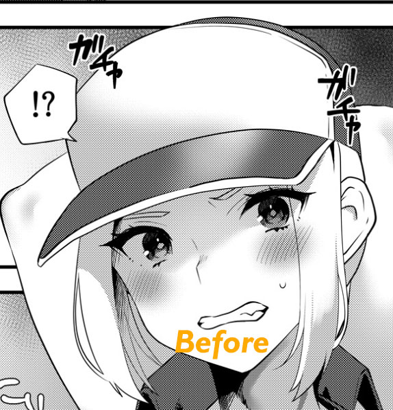
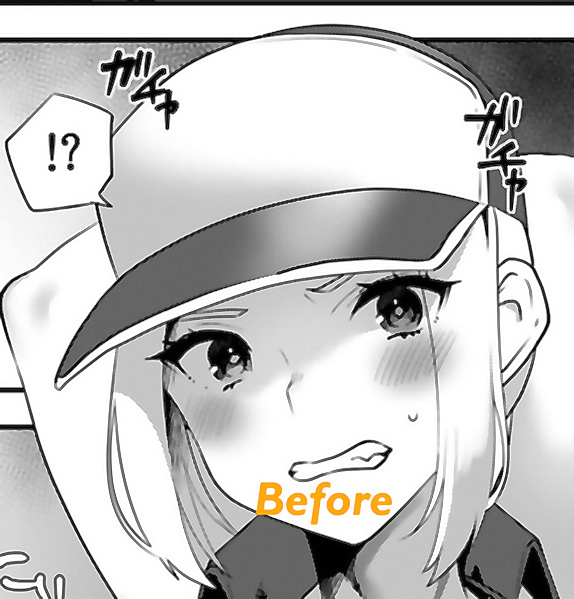
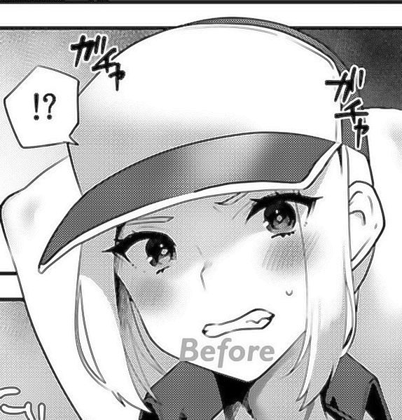

## retone
https://github.com/natethegreate/Screentone-Remover 用高斯模糊（+双边滤波）做到了去screentone，但是我修复完图片，我缺的screentone这块谁给我补啊？？？  
本脚本意在解决此问题，它可以从未处理的图提取screentone，并覆盖回已处理的图。  
缺点是提取的screentone的“浓度”（即网点大小）有一点损失。  
原理是，将图像放大2倍，再缩小回原尺寸，得到的图像与原图作差，就能提取出screentone。很神奇，我也不知道为啥。  
这个脚本的一大优点是，它可以输出提取的screentone，然后你可以手动修复黑条部分的screentone。（用ps的修复笔工具对准两个网点即可）  
或者...我的下一个脚本...也许就能自动补全了。
### 效果
原图：  
  
Screentone-Remover处理后  
  
用此脚本从原图转移screentone  
  
